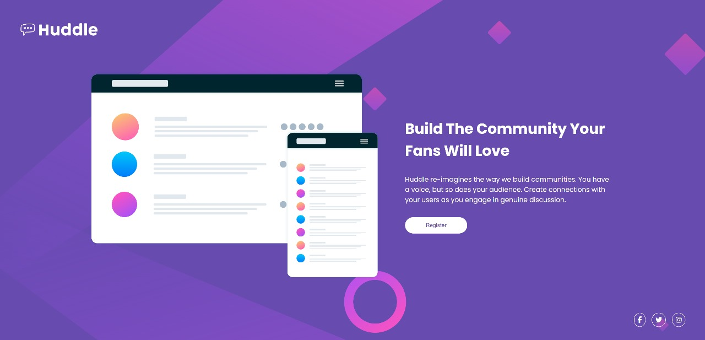
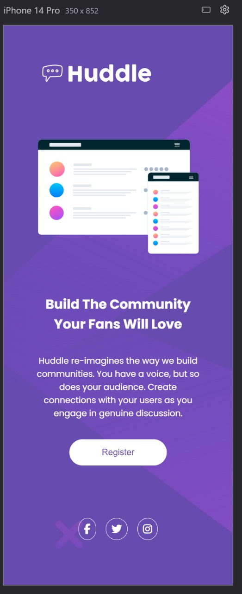

# Projeto Huddle - Página de Registro

Este projeto é um exercício prático proposto pelo curso **DevQuest** em parceria com o desafio do site **Frontend Mentor**.  
O objetivo é treinar habilidades de HTML e CSS, com foco em construção de layouts, organização de componentes e design responsivo.

## 💻 Sobre o projeto

A página representa uma landing page do serviço Huddle, com um layout moderno e atrativo. O foco está na apresentação visual, uso de gradientes, tipografia clara.

## 📸 Preview do Projeto

## 🚀 Tecnologias utilizadas

- HTML5
- CSS3

## 🧠 Aprendizados

- Como estruturar uma landing page responsiva
- Utilização de gradientes no background
- Alinhamento de elementos com Flexbox
- Criação de botões com efeito de sombra e transições suaves

## 🧩 Fontes do desafio

- Curso: [DevQuest](https://devquest.com.br)
- Desafio: [Frontend Mentor](https://www.frontendmentor.io)

---
